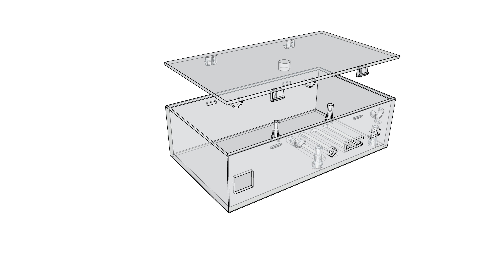

# kapture 3D printable case 

> Simple [shitty] case that will allow you to create your own in home netflix server

# Case Preview

# Viewing / printing

These models are created with SketchUP, and starts with the main file `kapture-case.skp` which has all the components together.  The other files are individual components exported from the main file every time for the purposes of printing via a 3d printer.

# Components

Last iteration of this, it was meant to hold the following components:

- [WD 1TB Elements Portable External Hard Drive - USB 3.0 - WDBUZG0010BBK-WESN](https://www.amazon.com/dp/B00CRZ2PRM)
- [Raspberry PI 3 Model B A1.2GHz 64-bit quad-core ARMv8 CPU, 1GB RAM](https://www.amazon.com/dp/B01CD5VC92)
- [SanDisk Ultra 32GB microSDHC UHS-I Card with Adapter, Grey/Red, Standard Packaging (SDSQUNC-032G-GN6MA)](https://www.amazon.com/dp/B010Q57T02)

Additionally, you'll need:

- [NorthPada 5V 2000mA Micro USB Mains Power Wall Supply Charger for Raspberry Pi 2 (A and B), Banana Pi B Plus and Android Tablets](https://www.amazon.com/dp/B00OY7HR1U)
- An ethernet cable.

You'll need to open up the hard drive case and put in just the bare hard drive upside down, with the RPi sitting below it screwed in with M2.5 x 5mm screws ([Amazon has them here](https://www.amazon.com/gp/product/B017AAEDS2))

# TODO

- Redesign this such that the ethernet cable going into the RPi isn't so ugly.
